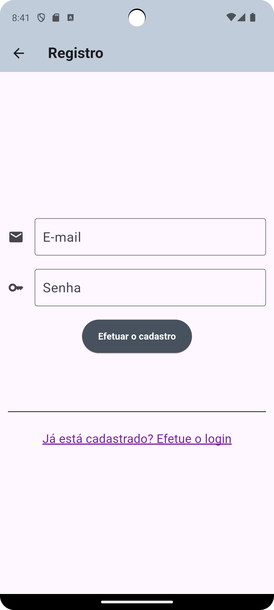
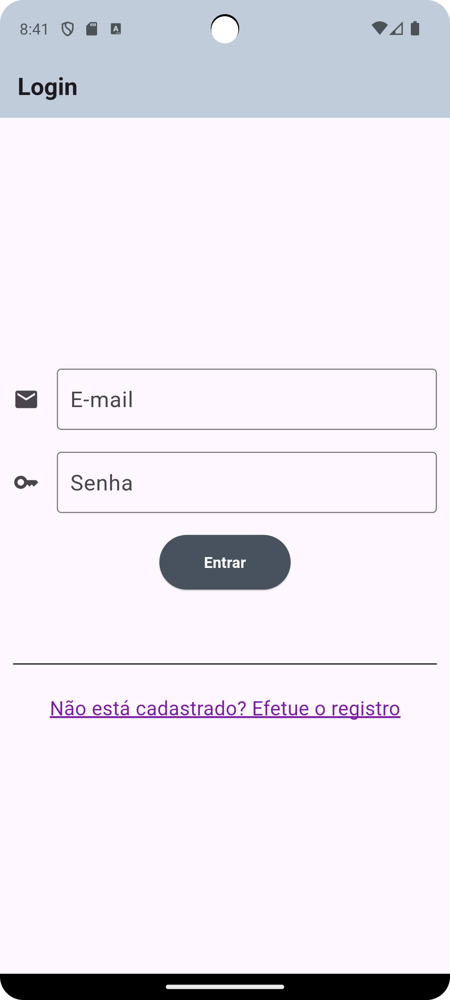
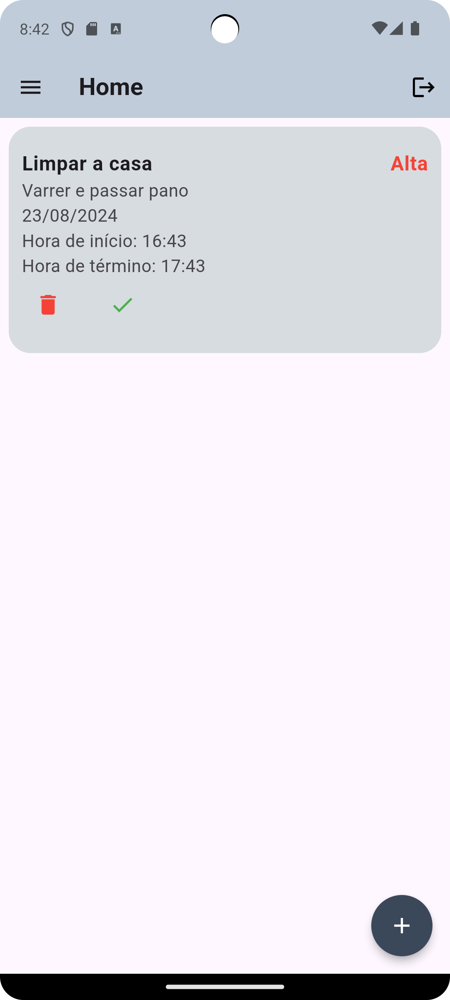
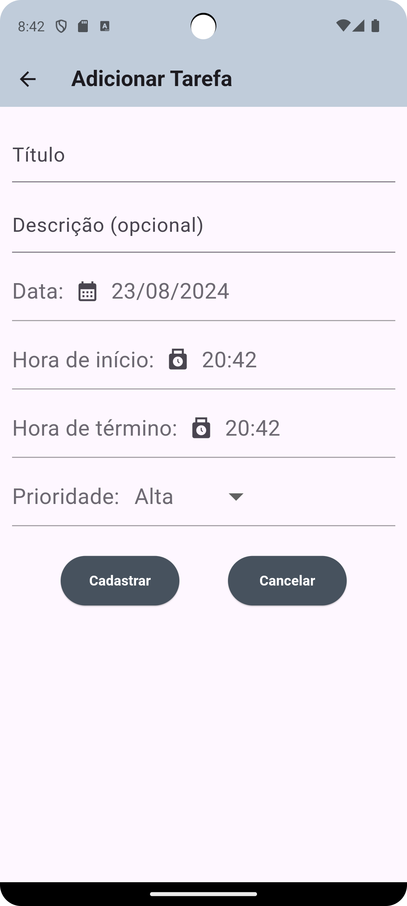
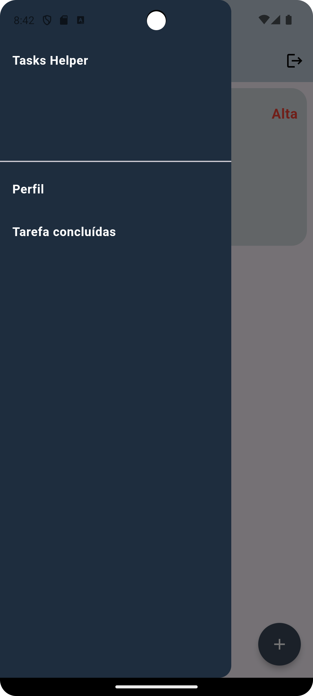
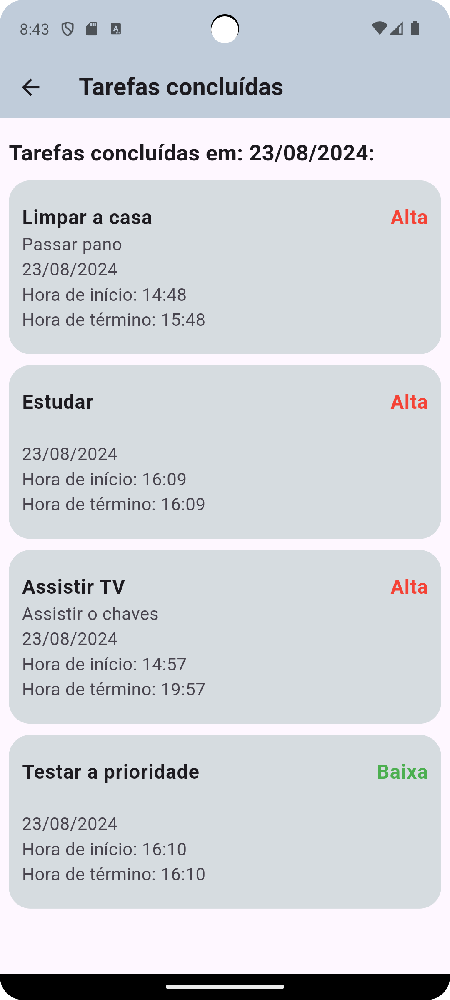

# Aplicativo mobile para gestão de tarefas

Este é um aplicativo de gestão de horários ou tarefas diárias. O aplicativo apresenta as seguintes características:
- possui tela de registro e de login;
- o usuário pode inserir título, descrição, data, data de início, data de término e nível de prioridade da tarefa;
- o usuário pode ver as tarefas concluídas no dia.

No âmbito técnico, o aplicativo possui as seguintes características:
- o aplicativo foi criado com o framework Flutter;
- o sistema de registro e de login utiliza os serviços do Google Firebase; e
- as tarefas são armazenadas no banco de dados Firestore do Google Firebase.

A seguir constam as telas do aplicativo:

1. Tela de registro

2. Tela de login

3. Tela Home

4. Tela Adicionar Tarefa

5. Tela Home com menu

6. Tela de perfil do usuário

7. Tela de tarefas concluídas no dia

